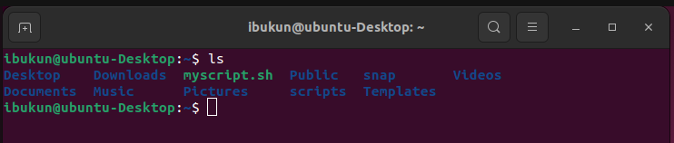

# Linux Practice Project

## A project on how to run **basic linux command** on ubuntu terminal

# Sudo command

Sudo command let you perform task that require administrative or root permission

`sudo apt upgrade`

# pwd command

`pwd`

# ls Command
`ls`
`This ls command list files and diectories within a system`

